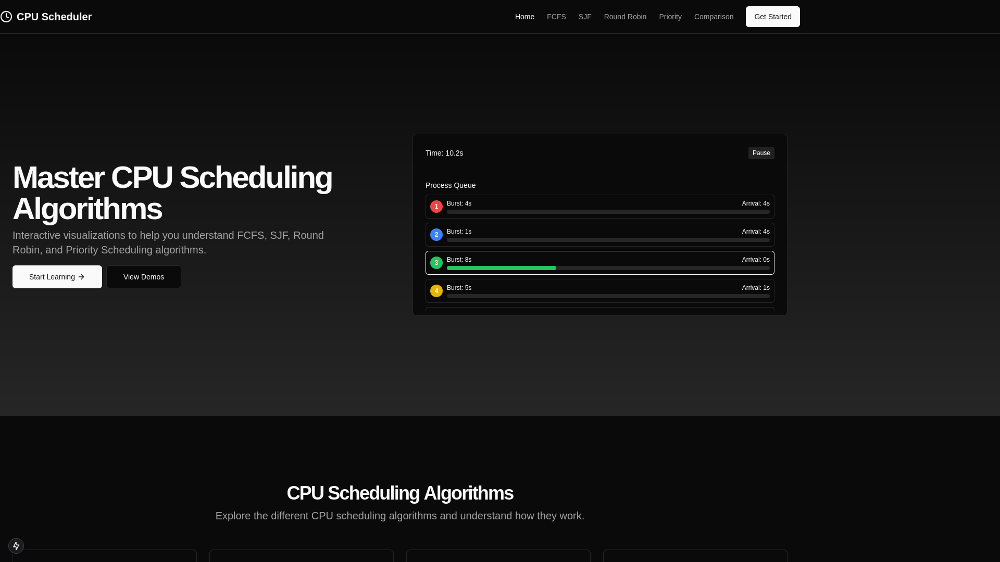

# CPU Scheduling Algorithms Visualizer

Interactive web application that helps students and professionals understand CPU scheduling algorithms through visual demonstrations and interactive simulations.



## 🌟 Features

- **Interactive Visualizations**: Animated demonstrations of various scheduling algorithms
- **Algorithm Comparisons**: Side-by-side comparison of different algorithms with the same process set
- **Customizable Inputs**: Create and modify process sets to see how algorithms behave with different inputs
- **Performance Metrics**: Calculate and display important metrics like average waiting time, turnaround time, etc.
- **Educational Content**: Learn about the theory behind each algorithm

## 🧮 Supported Algorithms

- **First-Come, First-Served (FCFS)**: Non-preemptive scheduling based on arrival order
- **Shortest Job First (SJF)**: Non-preemptive scheduling based on burst time
- **Round Robin (RR)**: Preemptive scheduling with time quantum
- **Priority Scheduling**: Non-preemptive scheduling based on priority values
- **Comparison Tool**: Compare all algorithms with the same process set

## 🚀 Getting Started

### Prerequisites

- Node.js 16.x or later
- npm or pnpm

### Installation

1. Clone the repository:
   ```bash
   git clone https://github.com/Schezwan-rice/cpu-scheduling-sim/cpu-scheduling-sim.git
   cd cpu-scheduling-visualizer
   ```

2. Install dependencies:
   ```bash
   npm install --legacy-peer-deps
   # or
   pnpm install
   ```

3. Start the development server:
   ```bash
   npm run dev
   # or
   pnpm dev
   ```

4. Open [http://localhost:3000](http://localhost:3000) in your browser.

## 💻 Usage

1. Navigate to the home page to learn about the different algorithms
2. Select an algorithm to visualize (FCFS, SJF, Round Robin, or Priority)
3. Input process details or use the provided examples
4. Run the visualization and observe the scheduling in action
5. Review the calculated metrics to understand algorithm performance
6. Use the comparison page to see how different algorithms handle the same process set

## 🛠️ Technologies

- **Next.js**: React framework for building the UI
- **TypeScript**: Type safety and better developer experience
- **Tailwind CSS**: Utility-first CSS framework for styling
- **Shadcn/UI**: Component library for consistent UI elements
- **Framer Motion**: Animation library for smooth visualizations
- **Chart.js**: For displaying performance metrics and comparisons

## 📚 Learning Resources

This application serves as a visual aid for understanding CPU scheduling algorithms commonly taught in Operating Systems courses. Additional resources:

- [CPU Scheduling in Operating Systems](https://en.wikipedia.org/wiki/Scheduling_(computing))
- [Process Scheduling Algorithms](https://www.geeksforgeeks.org/cpu-scheduling-in-operating-systems/)
- [Performance Metrics for Scheduling Algorithms](https://www.tutorialspoint.com/operating_system/os_process_scheduling_algorithms.htm)

## 🤝 Contributing

Contributions are welcome! Please feel free to submit a Pull Request.

1. Fork the repository
2. Create your feature branch (`git checkout -b feature/amazing-feature`)
3. Commit your changes (`git commit -m 'Add some amazing feature'`)
4. Push to the branch (`git push origin feature/amazing-feature`)
5. Open a Pull Request

## 📄 License

This project is licensed under the MIT License - see the [LICENSE](LICENSE) file for details.

## 🙏 Acknowledgements

- Operating Systems course materials that inspired this project
- The Next.js and React communities for excellent documentation
- [Shadcn/UI](https://ui.shadcn.com/) for beautiful UI components

---

